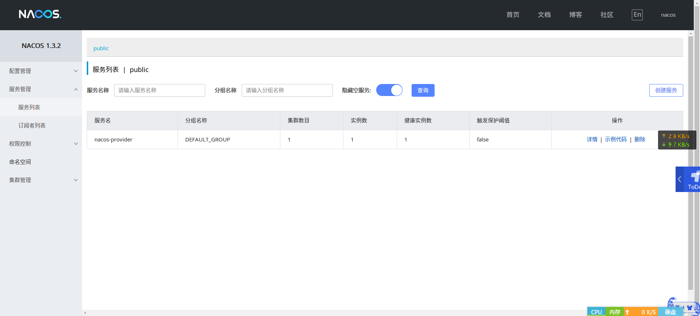
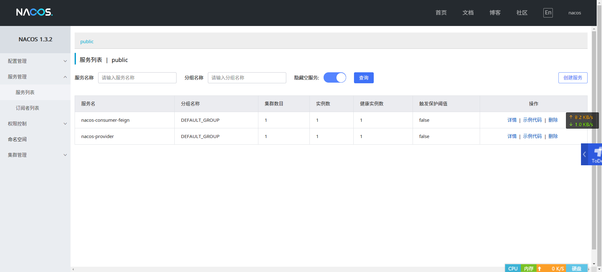
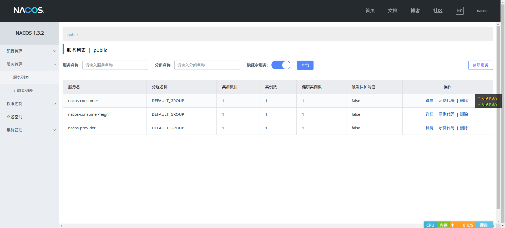
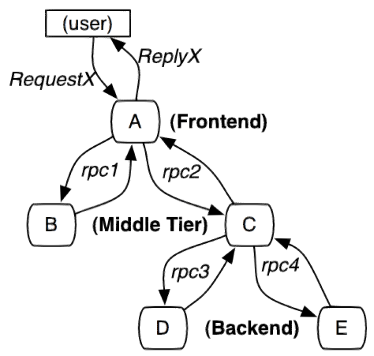
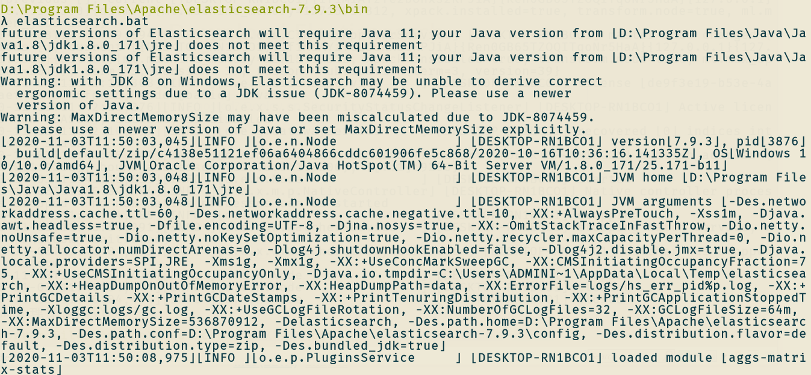
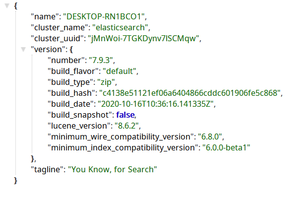
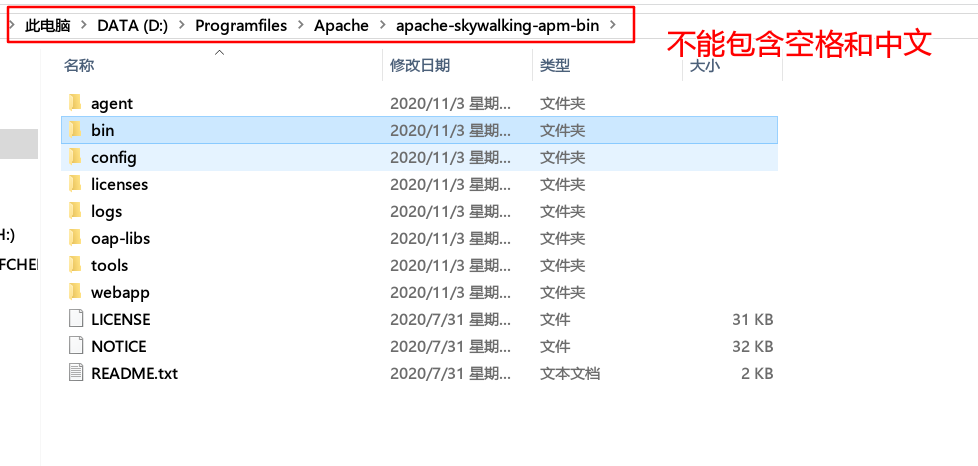
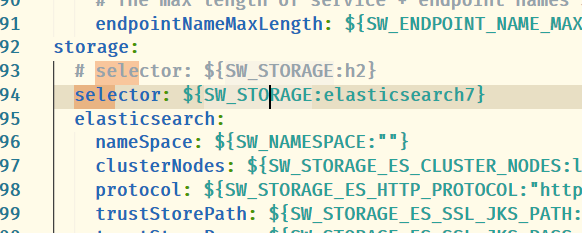
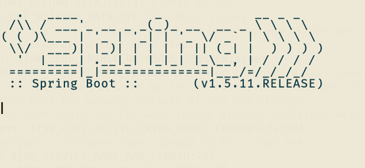
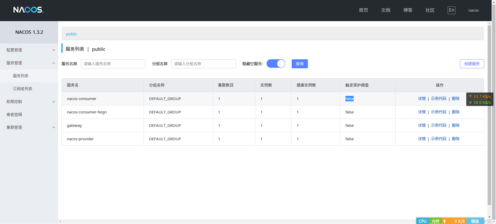

[toc]

## 〇、介绍

笔记来源于教程 [Spring Cloud Alibaba](https://www.funtl.com/zh/spring-cloud-alibaba/#%E6%9C%AC%E8%8A%82%E8%A7%86%E9%A2%91)。视频在线观看地址为：https://www.bilibili.com/video/BV1ht411h772?p=1

## 一、Spring Cloud Alibaba 简介

### 1.1 概述

**2018 年 10 月 31 日的凌晨，这个伟大的日子里，Spring Cloud Alibaba 正式入驻了 Spring Cloud 官方孵化器，并在 Maven 中央库发布了第一个版本。**

[Spring Cloud for Alibaba 0.2.0 released](https://spring.io/blog/2018/10/30/spring-cloud-for-alibaba-0-2-0-released)

> The Spring Cloud Alibaba project, consisting of Alibaba’s open-source components and several Alibaba Cloud products, aims to implement and expose well known Spring Framework patterns and abstractions to bring the benefits of Spring Boot and Spring Cloud to Java developers using Alibaba products.

> Spring Cloud for Alibaba，它是由一些阿里巴巴的开源组件和云产品组成的。这个项目的目的是为了让大家所熟知的 Spring 框架，其优秀的设计模式和抽象理念，以给使用阿里巴巴产品的 Java 开发者带来使用 Spring Boot 和 Spring Cloud 的更多便利。

Spring Cloud Alibaba 致力于提供微服务开发的一站式解决方案。此项目包含开发分布式应用微服务的必需组件，方便开发者通过 Spring Cloud 编程模型轻松使用这些组件来开发分布式应用服务。

依托 Spring Cloud Alibaba，您只需要添加一些注解和少量配置，就可以将 Spring Cloud 应用接入阿里微服务解决方案，通过阿里中间件来迅速搭建分布式应用系统。

### 1.2 主要功能

- 服务限流降级：默认支持 Servlet、Feign。RestTemplate、Dubbo 和 RocketMQ 限流降级功能的接入，可以在运行时通过控制台实时修改限流降级规则，还支持查看限流降级 Metrics 监控；
- 服务注册与发现：适配 Spring Cloud 服务注册与发现标准，默认集成了 Ribbon 的支持。
- 分布式配置管理：支持分布式系统中的外部化配置，配置更改时自动刷新；
- 消息驱动能力：基于 Spring Cloud Stream 为微服务应用构建消息驱动能力；
- 阿里云对象存储：阿里云提供的海量、安全、低成本、高可用的云存储服务。支持在任何应用、任何时间、任何地点存储和访问任意类型的数据。
- 分布式任务调度：提供妙极、精准、高可靠、高可用的定时（基于 Cron 表达式）任务调度服务。同时提供分布式的任务执行模型，如网格服务。网格任务支持海量子任务均匀分配到所逼的 worker（schedux-client）上执行；

### 1.3 组件

- **Sentinel**：把流量作为切入点，从流量控制、熔断降级、系统负载保护等多个维度保护服务的稳定性。
- **Nacos**：一个更易于构建云原生应用的动态服务发现、配置管理和服务管理平台。
- **RocketMQ**：一款开源的分布式消息系统，基于高可用分布式集群技术，提供低延时的、高可靠的消息发布与订阅服务。
- **Alibaba Cloud ACM**：一款在分布式架构环境中对应用配置进行集中管理和推送的应用配置中心产品。
- **Alibaba Cloud OSS**: 阿里云对象存储服务（Object Storage Service，简称 OSS），是阿里云提供的海量、安全、低成本、高可靠的云存储服务。您可以在任何应用、任何时间、任何地点存储和访问任意类型的数据。
- **Alibaba Cloud SchedulerX**: 阿里中间件团队开发的一款分布式任务调度产品，提供秒级、精准、高可靠、高可用的定时（基于 Cron 表达式）任务调度服务。

## 二、创建项目工程

### 2.1 创建统一依赖项目

创建目录 depencencies ，然后在该目录中添加 pom 文件，文件内容如下所示：

```xml
<?xml version="1.0" encoding="UTF-8"?>
<project xmlns="http://maven.apache.org/POM/4.0.0" xmlns:xsi="http://www.w3.org/2001/XMLSchema-instance"
         xsi:schemaLocation="http://maven.apache.org/POM/4.0.0 http://maven.apache.org/xsd/maven-4.0.0.xsd">
    <modelVersion>4.0.0</modelVersion>

    <parent>
        <groupId>org.springframework.boot</groupId>
        <artifactId>spring-boot-starter-parent</artifactId>
        <version>2.0.6.RELEASE</version>
    </parent>

    <groupId>com.chen</groupId>
    <artifactId>dependencies</artifactId>
    <version>1.0.0-SNAPSHOT</version>
    <packaging>pom</packaging>

    <name>dependencies</name>
    <url>http://www.funtl.com</url>
    <inceptionYear>2018-Now</inceptionYear>

    <properties>
        <!-- Environment Settings we
        -->
        <java.version>1.8</java.version>
        <project.build.sourceEncoding>UTF-8</project.build.sourceEncoding>
        <project.reporting.outputEncoding>UTF-8</project.reporting.outputEncoding>

        <!-- Spring Settings -->
        <spring-cloud.version>Finchley.SR2</spring-cloud.version>
        <spring-cloud-alibaba.version>0.2.1.RELEASE</spring-cloud-alibaba.version>
    </properties>

    <dependencyManagement>
        <dependencies>
            <dependency>
                <groupId>org.springframework.cloud</groupId>
                <artifactId>spring-cloud-dependencies</artifactId>
                <version>${spring-cloud.version}</version>
                <type>pom</type>
                <scope>import</scope>
            </dependency>
            <dependency>
                <groupId>org.springframework.cloud</groupId>
                <artifactId>spring-cloud-alibaba-dependencies</artifactId>
                <version>${spring-cloud-alibaba.version}</version>
                <type>pom</type>
                <scope>import</scope>
            </dependency>
        </dependencies>
    </dependencyManagement>

    <build>
        <plugins>
            <!-- Compiler 插件, 设定 JDK 版本 -->
            <plugin>
                <groupId>org.apache.maven.plugins</groupId>
                <artifactId>maven-compiler-plugin</artifactId>
                <configuration>
                    <showWarnings>true</showWarnings>
                </configuration>
            </plugin>

            <!-- 打包 jar 文件时，配置 manifest 文件，加入 lib 包的 jar 依赖 -->
            <plugin>
                <groupId>org.apache.maven.plugins</groupId>
                <artifactId>maven-jar-plugin</artifactId>
                <configuration>
                    <archive>
                        <addMavenDescriptor>false</addMavenDescriptor>
                    </archive>
                </configuration>
                <executions>
                    <execution>
                        <configuration>
                            <archive>
                                <manifest>
                                    <!-- Add directory entries -->
                                    <addDefaultImplementationEntries>true</addDefaultImplementationEntries>
                                    <addDefaultSpecificationEntries>true</addDefaultSpecificationEntries>
                                    <addClasspath>true</addClasspath>
                                </manifest>
                            </archive>
                        </configuration>
                    </execution>
                </executions>
            </plugin>

            <!-- resource -->
            <plugin>
                <groupId>org.apache.maven.plugins</groupId>
                <artifactId>maven-resources-plugin</artifactId>
            </plugin>

            <!-- install -->
            <plugin>
                <groupId>org.apache.maven.plugins</groupId>
                <artifactId>maven-install-plugin</artifactId>
            </plugin>

            <!-- clean -->
            <plugin>
                <groupId>org.apache.maven.plugins</groupId>
                <artifactId>maven-clean-plugin</artifactId>
            </plugin>

            <!-- ant -->
            <plugin>
                <groupId>org.apache.maven.plugins</groupId>
                <artifactId>maven-antrun-plugin</artifactId>
            </plugin>

            <!-- dependency -->
            <plugin>
                <groupId>org.apache.maven.plugins</groupId>
                <artifactId>maven-dependency-plugin</artifactId>
            </plugin>
        </plugins>

        <pluginManagement>
            <plugins>
                <!-- Java Document Generate -->
                <plugin>
                    <groupId>org.apache.maven.plugins</groupId>
                    <artifactId>maven-javadoc-plugin</artifactId>
                    <executions>
                        <execution>
                            <phase>prepare-package</phase>
                            <goals>
                                <goal>jar</goal>
                            </goals>
                        </execution>
                    </executions>
                </plugin>

                <!-- YUI Compressor (CSS/JS压缩) -->
                <plugin>
                    <groupId>net.alchim31.maven</groupId>
                    <artifactId>yuicompressor-maven-plugin</artifactId>
                    <version>1.5.1</version>
                    <executions>
                        <execution>
                            <phase>prepare-package</phase>
                            <goals>
                                <goal>compress</goal>
                            </goals>
                        </execution>
                    </executions>
                    <configuration>
                        <encoding>UTF-8</encoding>
                        <jswarn>false</jswarn>
                        <nosuffix>true</nosuffix>
                        <linebreakpos>30000</linebreakpos>
                        <force>true</force>
                        <includes>
                            <include>**/*.js</include>
                            <include>**/*.css</include>
                        </includes>
                        <excludes>
                            <exclude>**/*.min.js</exclude>
                            <exclude>**/*.min.css</exclude>
                        </excludes>
                    </configuration>
                </plugin>
            </plugins>
        </pluginManagement>

        <!-- 资源文件配置 -->
        <resources>
            <resource>
                <directory>src/main/java</directory>
                <excludes>
                    <exclude>**/*.java</exclude>
                </excludes>
            </resource>
            <resource>
                <directory>src/main/resources</directory>
            </resource>
        </resources>
    </build>

    <repositories>
        <repository>
            <id>aliyun-repos</id>
            <name>Aliyun Repository</name>
            <url>http://maven.aliyun.com/nexus/content/groups/public</url>
            <releases>
                <enabled>true</enabled>
            </releases>
            <snapshots>
                <enabled>false</enabled>
            </snapshots>
        </repository>

        <repository>
            <id>sonatype-repos</id>
            <name>Sonatype Repository</name>
            <url>https://oss.sonatype.org/content/groups/public</url>
            <releases>
                <enabled>true</enabled>
            </releases>
            <snapshots>
                <enabled>false</enabled>
            </snapshots>
        </repository>
        <repository>
            <id>sonatype-repos-s</id>
            <name>Sonatype Repository</name>
            <url>https://oss.sonatype.org/content/repositories/snapshots</url>
            <releases>
                <enabled>false</enabled>
            </releases>
            <snapshots>
                <enabled>true</enabled>
            </snapshots>
        </repository>

        <repository>
            <id>spring-snapshots</id>
            <name>Spring Snapshots</name>
            <url>https://repo.spring.io/snapshot</url>
            <snapshots>
                <enabled>true</enabled>
            </snapshots>
        </repository>
        <repository>
            <id>spring-milestones</id>
            <name>Spring Milestones</name>
            <url>https://repo.spring.io/milestone</url>
            <snapshots>
                <enabled>false</enabled>
            </snapshots>
        </repository>
    </repositories>

    <pluginRepositories>
        <pluginRepository>
            <id>aliyun-repos</id>
            <name>Aliyun Repository</name>
            <url>http://maven.aliyun.com/nexus/content/groups/public</url>
            <releases>
                <enabled>true</enabled>
            </releases>
            <snapshots>
                <enabled>false</enabled>
            </snapshots>
        </pluginRepository>
    </pluginRepositories>
</project>

```

上面的 pom 文件中，主要管理了两个依赖：spring-cloud-dependencies 以及 spring-cloud-alibaba-dependencies 。

### 2.2 创建服务提供者 nacos-provider

创建一个目录 nacos-provider （和 dependencies 同一级目录），新建 pom 文件，并在 pom 文件中添加以下内容：

```xml
<?xml version="1.0" encoding="UTF-8"?>
<project xmlns="http://maven.apache.org/POM/4.0.0" xmlns:xsi="http://www.w3.org/2001/XMLSchema-instance"
         xsi:schemaLocation="http://maven.apache.org/POM/4.0.0 http://maven.apache.org/xsd/maven-4.0.0.xsd">
    <modelVersion>4.0.0</modelVersion>

    <parent>
        <groupId>com.chen</groupId>
        <artifactId>dependencies</artifactId>
        <version>1.0.0-SNAPSHOT</version>
        <relativePath>../dependencies/pom.xml</relativePath>
    </parent>

    <artifactId>nacos-provider</artifactId>
    <packaging>jar</packaging>

    <name>provider</name>

    <dependencies>
        <!-- Spring Boot Begin -->
        <dependency>
            <groupId>org.springframework.boot</groupId>
            <artifactId>spring-boot-starter-web</artifactId>
        </dependency>
        <dependency>
            <groupId>org.springframework.boot</groupId>
            <artifactId>spring-boot-starter-actuator</artifactId>
        </dependency>
        <dependency>
            <groupId>org.springframework.boot</groupId>
            <artifactId>spring-boot-starter-test</artifactId>
            <scope>test</scope>
        </dependency>
        <!-- Spring Boot End -->

        <!-- Spring Cloud Begin -->
        <dependency>
            <groupId>org.springframework.cloud</groupId>
            <artifactId>spring-cloud-starter-alibaba-nacos-discovery</artifactId>
        </dependency>
        <!-- Spring Cloud End -->
    </dependencies>

    <build>
        <plugins>
            <plugin>
                <groupId>org.springframework.boot</groupId>
                <artifactId>spring-boot-maven-plugin</artifactId>
                <configuration>
                    <mainClass>com.chen.hello.spring.cloud.alibaba.nacos.provider.NacosProviderApplication</mainClass>
                </configuration>
            </plugin>
        </plugins>
    </build>
</project>

```

编写配置文件：

```yaml
spring:
  application:
    name: nacos-provider
  cloud:
    nacos:
      discovery:
        server-addr: 10.4.60.73:8848

server:
  port: 8081

management:
  endpoints:
    web:
      exposure:
        include: "*"
```


依据包名，创建对应的启动类：

```java
/**
 * @Author: ChromeChen
 * @Description: Nacos 服务提供者
 * @Date: Created in 22:03 2020/11/1 0001
 * @Modified By:
 */
@SpringBootApplication
@EnableDiscoveryClient	// ①
public class NacosProviderApplication {

    public static void main(String[] args) {
        SpringApplication.run(NacosProviderApplication.class, args);
    }

    /**
     * 为了简洁，原来还可以直接作为内部类的写法 ^_^
     */
    @RestController
    public class EchoController {
        @GetMapping(value = "/echo/{message}")
        public String echo(@PathVariable String message) {
            return "这是来自于 provider 的消息：" + message;
        }
    }
}
```

① 当前项目开启服务注册与发现。通过这个注解，我们可以将当前服务注册到 nacos 中。

启动项目，然后观察 nacos 服务列表，可以发现当前服务已经注册到 nacos 注册中心中：



### 2.3 创建服务消费者 nacos-consumer

创建文件夹 nacos-consumer，然后添加 pom 文件，在文件中添加以下信息：

```xml
<?xml version="1.0" encoding="UTF-8"?>
<project xmlns="http://maven.apache.org/POM/4.0.0" xmlns:xsi="http://www.w3.org/2001/XMLSchema-instance"
         xsi:schemaLocation="http://maven.apache.org/POM/4.0.0 http://maven.apache.org/xsd/maven-4.0.0.xsd">
    <modelVersion>4.0.0</modelVersion>

    <parent>
        <groupId>com.chen</groupId>
        <artifactId>dependencies</artifactId>
        <version>1.0.0-SNAPSHOT</version>
        <relativePath>../dependencies/pom.xml</relativePath>
    </parent>

    <artifactId>nacos-consumer</artifactId>
    <packaging>jar</packaging>

    <name>nacos-consumer</name>

    <dependencies>
        <!-- Spring Boot Begin -->
        <dependency>
            <groupId>org.springframework.boot</groupId>
            <artifactId>spring-boot-starter-web</artifactId>
        </dependency>
        <dependency>
            <groupId>org.springframework.boot</groupId>
            <artifactId>spring-boot-starter-actuator</artifactId>
        </dependency>
        <dependency>
            <groupId>org.springframework.boot</groupId>
            <artifactId>spring-boot-starter-test</artifactId>
            <scope>test</scope>
        </dependency>
        <!-- Spring Boot End -->

        <!-- Spring Cloud Begin -->
        <dependency>
            <groupId>org.springframework.cloud</groupId>
            <artifactId>spring-cloud-starter-alibaba-nacos-discovery</artifactId>
        </dependency>
        <!-- Spring Cloud End -->
    </dependencies>

    <build>
        <plugins>
            <plugin>
                <groupId>org.springframework.boot</groupId>
                <artifactId>spring-boot-maven-plugin</artifactId>
                <configuration>
                    <mainClass>com.chen.hello.spring.cloud.alibaba.nacos.consumer.NacosConsumerApplication</mainClass>
                </configuration>
            </plugin>
        </plugins>
    </build>
</project>

```

编写启动类：

```java
/**
 * @Author: ChromeChen
 * @Description: Nacos 服务消费者，让消费者去调用服务提供者
 * @Date: Created in 22:10 2020/11/1 0001
 * @Modified By:
 */
@SpringBootApplication
@EnableDiscoveryClient
public class NacosConsumerApplication {

    public static void main(String[] args) {
        SpringApplication.run(NacosConsumerApplication.class, args);
    }
}
```

创建 application.yml 文件：

```yaml
spring:
  application:
    name: nacos-consumer
  cloud:
    nacos:
      discovery:
        server-addr: 10.4.60.73:8848

server:
  port: 9091

management:
  endpoints:
    web:
      exposure:
        include: "*"
```


可以看到：配置基本和 provider 一致。

启动项目以后，可以发现 nacos-consumer 也注册到 nacos 中了：



#### 2.3.1 consumer 调用 provider

为了可以达到 consumer 调用 provider，我们需要使用 RestTemplate 的实例进行调用。

创建 RestTemplate 实例：

```java
/**
 * @Author: ChromeChen
 * @Description:
 * @Date: Created in 22:12 2020/11/1 0001
 * @Modified By:
 */
@Component
public class NacosConsumerConfiguration {

    @Bean
    public RestTemplate restTemplate() {
        return new RestTemplate();
    }

}
```

上面的代码向 Spring 容器中注册了一个 RestTemplate 的 Bean。

然后我们在 consumer 控制器中通过 RestTemplate 调用 provider 的内容：

```java
@RestController
public class NacosConsumerController {

    @Autowired
    private LoadBalancerClient loadBalancerClient;

    @Autowired
    private RestTemplate restTemplate;

    @GetMapping(value = "/echo/app/name")
    public String echo() {
        //使用 LoadBalanceClient 和 RestTemplate 结合的方式来访问
        ServiceInstance serviceInstance = loadBalancerClient.choose("nacos-provider");
        String url = String.format("http://%s:%s/echo/hahaha", serviceInstance.getHost(), serviceInstance.getPort());
        
        String message = "nacos-consumer 调用 provider 消息：" + restTemplate.getForObject(url, String.class);   // ①
        return message;
    }
}
```

① 这行代码就是 consumer 调用 provider，在调用的时候，需要传递两个参数：url 和返回值类型。

- url 由以下几部分组成：IP、端口、请求路径；其中，IP 和端口都是从 LoadBalancerClient 获得。

我们访问 consumer 的请求：`localhost:9091/echo/app/name`，此时页面会返回以下信息：


这说明：consumer 已经通过 RestTemplate 成功调用到了 provider 。

#### 2.3.2 总结

通过上面的创建流程，我们可以发现：

1. alibaba 微服务搭建流程：基本 SpringBoot 项目 + 启动类上 @EnableDiscoveryClient 注解 + 配置文件；
2. 通过 RestTemplate 调用：需要传递 url 参数，url 中的 IP 和端口都来自于 LoadBalancerClient 。

### 2.4 创建服务消费者 nacos-consumer-feign

这个项目是为了联系如何使用 feign 来实现远程调用（也就是调用 provider 服务）。

创建文件夹 nacos-consumer-feign ，创建 pom 文件，并在文件中添加以下代码：

```xml
<?xml version="1.0" encoding="UTF-8"?>
<project xmlns="http://maven.apache.org/POM/4.0.0" xmlns:xsi="http://www.w3.org/2001/XMLSchema-instance"
         xsi:schemaLocation="http://maven.apache.org/POM/4.0.0 http://maven.apache.org/xsd/maven-4.0.0.xsd">
    <modelVersion>4.0.0</modelVersion>

    <parent>
        <groupId>com.chen</groupId>
        <artifactId>dependencies</artifactId>
        <version>1.0.0-SNAPSHOT</version>
        <relativePath>../dependencies/pom.xml</relativePath>
    </parent>

    <artifactId>nacos-consumer-feign</artifactId>
    <packaging>jar</packaging>

    <name>consumer-feign</name>

    <dependencies>
        <!-- Spring Boot Begin -->
        <dependency>
            <groupId>org.springframework.boot</groupId>
            <artifactId>spring-boot-starter-web</artifactId>
        </dependency>
        <dependency>
            <groupId>org.springframework.boot</groupId>
            <artifactId>spring-boot-starter-actuator</artifactId>
        </dependency>
        <dependency>
            <groupId>org.springframework.boot</groupId>
            <artifactId>spring-boot-starter-test</artifactId>
            <scope>test</scope>
        </dependency>
        <!-- Spring Boot End -->

        <!-- Spring Cloud Begin -->
        <dependency>
            <groupId>org.springframework.cloud</groupId>
            <artifactId>spring-cloud-starter-alibaba-nacos-discovery</artifactId>
        </dependency>
        <dependency>
            <groupId>org.springframework.cloud</groupId>
            <artifactId>spring-cloud-starter-openfeign</artifactId>
        </dependency>
        <!-- Spring Cloud End -->
    </dependencies>

    <build>
        <plugins>
            <plugin>
                <groupId>org.springframework.boot</groupId>
                <artifactId>spring-boot-maven-plugin</artifactId>
                <configuration>
                    <mainClass>com.chen.hello.spring.cloud.alibaba.nacos.consumer.feign.NacosConsumerFeignApplication</mainClass>
                </configuration>
            </plugin>
        </plugins>
    </build>
</project>

```

创建启动类：

```java
/**
 * @Author: ChromeChen
 * @Description:
 * @Date: Created in 22:16 2020/11/1 0001
 * @Modified By:
 */
@SpringBootApplication
@EnableDiscoveryClient
@EnableFeignClients	// ①
public class NacosConsumerFeignApplication {

    public static void main(String[] args) {
        SpringApplication.run(NacosConsumerFeignApplication.class, args);
    }
}
```

① 增加了 @EnableFeignClients 注解，开启feign 调用。

编写 application.yml 文件：

```yaml
spring:
  application:
    name: nacos-consumer-feign
  cloud:
    nacos:
      discovery:
        server-addr: 10.4.60.73:8848

server:
  port: 9092

management:
  endpoints:
    web:
      exposure:
        include: "*"
```

启动项目，可以发现 nacos-consumer-feign 成功注册到 nacos 中：



#### 2.4.1 通过 feign 进行远程调用

创建一个接口 EchoService

```java
@FeignClient(value = "nacos-provider")	// ① 
public interface EchoService {

    @GetMapping(value = "/echo/{message}")	// ②
    String echo(@PathVariable("message") String message);
}
```

① 该注解表示当前接口会调用远程服务，远程服务名为 nacos-provider；

② 指定远程服务的地址；

此时，consumer-feign 服务已经拥有了调用 provider 服务的能力，此时，我们只需要再在 consumer-feign 项目中暴露一个接口，并在该接口中调用 provider 服务即可。

```java
@RestController
public class NacosConsumerFeignController {

    @Autowired
    private EchoService echoService;	// ①

    @GetMapping(value = "/echo/hi")
    public String echo() {
        return echoService.echo("来自 consumer-feign 的调用：");
    }
}
```

① 可以直接注入 EchoService（也就是说：我们可以直接注入『使用 @EnableFeignClients 修饰的接口』）。

启动项目，并访问地址 `localhost:9092/echo/hi`，可以得到以下输出：


#### 2.4.2 总结

通过上面的例子可以看出：

feign 调用时，可以直接定义接口，只需要在该接口上添加注解 @EnableFeignClients 即可。该接口可以直接被注入（注入的应该是代理）。我们可以在该接口中定义多个请求，只需要对应同一个服务提供者即可。

## 四、链路追踪

### 4.1 什么是链路追踪

微服务架构是通过业务来划分服务的，使用 REST 调用。对外暴露一个接口，可能需要很多个服务协同才能完成这个接口的功能。如果链路上任何一个服务出现问题或者网络超时，都会导致接口调用失败。随着业务的不断扩张，服务之间的相互调用会越来越复杂。




面对以上情况，我们需要一些可以帮助理解系统行为、用于分析性能问题的工具，以便于在发生故障的时候，能够快速定位和解决问题。这就是所谓的 APM（应用性能管理）。

### 4.2 什么是 SkyWalking

目前主要的一些 APM 工具有：Cat、Zipkin、Pinpoint、SkyWalking；Apache SkyWalking 是观察性能分析平台和应用性能管理系统。提供分布式追踪。服务网格遥测分析。度量聚合和可视化一体解决方案。


SkyWalking 的组成部分有：

- **SkyWalking Agent**：使用 JavaAgent 做字节码植入，无侵入式的收集，并通过 HTTP 或者 gRPC 方式发送数据到 SkyWalking Collector；
- **SkyWalking Collector**：链路数据收集器，对 agent 传过来的数据进行整合分析处理并落入相关的数据存储中；
- **Storage：SkyWalking** 的存储，时间更迭，SW 已经开发迭代到了 6.x 版本，在 6.x 版本中支持以 ElasticSearch、MySQL、TiDB、H2 等数据库作为存储截止进行数据存储；
- **UI**：Web 可视化平台，用来展示落地数据；

### 4.3 SkyWalking 的功能特性

- 多种监控手段，语言探针和服务网格（Service Mesh）
- 多语言自动探针，Java、.NET Core 和 Node.JS
- 轻量高效，UI、存储、集群管理多种机制可选；
- 支持告警；
- 优秀的可视化方案；

### 4.4 配置 SkyWalking 服务端

从上面的介绍中可以看出来：SkyWalking  Collector 就是 SkyWalking 就是其服务端，而且支持 ElasticSearch 作为其存储介质。下面就来介绍如何安装 SkywAlking 服务端。

如果我们需要使用 ElasticSearch 作为其存储结构，我们需要先安装 ElasticSearch 服务器。本次例子是基于 Windows 系统安装 ElasticSearch 和 SkyWalking的。

#### 4.4.1 Windows 安装 ElasticSearch 服务器

首先去到官网下载 ElasticSearch 的压缩包：https://www.elastic.co/cn/downloads/elasticsearch 。

下载完成以后，解压到某个目录下，然后进入到该目录的 bin 子目录中，运行：

```bash
elasticsearch.bat
```

以下日志：



> 注意：启动 ElasticSearch 的时候，需要设置 JAVA_HOME 环境变量，如果该环境变量没有设置正确，会出现错误。

启动完成以后，我们访问地址： localhost:9200。如果启动成功，那么会返回以下信息：



#### 4.4.2 Windows 安装 SkyWalking

当按照上面的教程成功运行 ElasticSearch 以后，我们接着安装 SkyWalking。

首先去到官网下载 SkyWalking 压缩包：http://skywalking.apache.org/downloads/

下载完成以后解压到指定路径（注意：该路径不能包含空格，也不能包含英文，如果包含空格，在启动 SkyWalking 的时候会出现错误）：



在运行以前，我们需要进入到 config 目录中修改配置文件。这是由于默认的配置下，SkyWalking 使用的存储介质是 H2 数据库，我们需要修改为 Elas 数据库。

打开 config 文件夹中的 application.yml 文件，搜索关键字 storage，然后在 selector 的标签中把 h2 修改为 elasticsearch7：



修改完成以后，进入到 bin 目录，然后运行 startup.bat 文件，会得到以下的输出：



> 通过上面的启动日志可以看出：SkyWalking 是一个 SpringBoot 项目，而且支持多种数据库，数据库的选择是通过 storage 标签指定的。


## 五、Spring Cloud Gatewa

### 5.1 什么是 Spring Cloud Gateway

Spring Cloud Gateway 是 Spring 官方基于 Spring 5.0，Spring Boot 2.0 和 Project Reactor 等技术开发的网关，Spring Cloud Gateway 旨在为微服务架构提供一种简单而有效的统一的 API 路由管理方式。**Spring Cloud Gateway 作为 Spring Cloud 生态系中的网关，目标是替代 Netflix ZUUL**，其不仅提供统一的路由方式，并且基于 Filter 链的方式提供了网关基本的功能，例如：安全，监控/埋点，和限流等。


> Spring Cloud Gateway 底层基于 Webflux，而不是 SpringMVC。而 Webflux 是基于 Netty，可以实现异步非阻塞的功能。

### 5.2 Spring Cloud Gateway 功能特征

- 基于 Spring Framework 5，Project Reactor 和 Spring Boot 2.0；
- 动态路由；
- Predicates 和 Filters 作用于特定路由；
- 继承 Hystrix 断路器；
- 集成 Spring Cloud DiscoveryClient
- 易于编写 Predicates 和 Filters；
- 限流；
- 路径重写；

### 5.3 Spring Cloud Gateway 工作流程


客户端向 Spring Cloud Gateway 发出请求。然后在 Gateway Handler Mapping 中找到与请求相匹配的路由，将其发送到 Gateway Web Handler。Handle 再通过指定的过滤器链来将请求发送到我们实际的服务执行业务逻辑，然后返回。

过滤器之间使用虚线分开是因为：过滤器可能会发送代理请求之前（`pre`）或之后（`post`）执行业务逻辑。

### 5.2 整合 Gateway 工程

#### 5.2.1 创建项目

创建目录 gateway，并新建 pom 文件，文件内容如下所示：

```xml
<?xml version="1.0" encoding="UTF-8"?>
<project xmlns="http://maven.apache.org/POM/4.0.0" xmlns:xsi="http://www.w3.org/2001/XMLSchema-instance"
         xsi:schemaLocation="http://maven.apache.org/POM/4.0.0 http://maven.apache.org/xsd/maven-4.0.0.xsd">
    <modelVersion>4.0.0</modelVersion>

    <parent>
        <groupId>com.chen</groupId>
        <artifactId>dependencies</artifactId>
        <version>1.0.0-SNAPSHOT</version>
        <relativePath>../dependencies/pom.xml</relativePath>
    </parent>

    <artifactId>gateway</artifactId>
    <packaging>jar</packaging>

    <name>gateway</name>

    <dependencies>
        <!-- Spring Boot Begin -->
        <dependency>
            <groupId>org.springframework.boot</groupId>
            <artifactId>spring-boot-starter-actuator</artifactId>
        </dependency>
        <dependency>
            <groupId>org.springframework.boot</groupId>
            <artifactId>spring-boot-starter-test</artifactId>
            <scope>test</scope>
        </dependency>
        <!-- Spring Boot End -->

        <!-- Spring Cloud Begin -->
        <dependency>
            <groupId>org.springframework.cloud</groupId>
            <artifactId>spring-cloud-starter-alibaba-nacos-discovery</artifactId>
        </dependency>
        <dependency>
            <groupId>org.springframework.cloud</groupId>
            <artifactId>spring-cloud-starter-alibaba-sentinel</artifactId>
        </dependency>
        <dependency>
            <groupId>org.springframework.cloud</groupId>
            <artifactId>spring-cloud-starter-openfeign</artifactId>
        </dependency>
        <dependency>
            <groupId>org.springframework.cloud</groupId>
            <artifactId>spring-cloud-starter-gateway</artifactId>
        </dependency>
        <!-- Spring Cloud End -->

        <!-- Commons Begin -->
        <dependency>
            <groupId>javax.servlet</groupId>
            <artifactId>javax.servlet-api</artifactId>
        </dependency>
        <!-- Commons Begin -->
    </dependencies>

    <build>
        <plugins>
            <plugin>
                <groupId>org.springframework.boot</groupId>
                <artifactId>spring-boot-maven-plugin</artifactId>
                <configuration>
                    <mainClass>com.chen.hello.spring.cloud.gateway.GatewayApplication</mainClass>
                </configuration>
            </plugin>
        </plugins>
    </build>
</project>

```

**注意：**

Spring Cloud Gatewa 不使用 Web 作为服务器，而是**<u>使用 WebFlux 作为服务器</u>**，Gateway 项目已经依赖了` starter-webflux`，所以不能依赖 `starter-web`；此外，由于过滤器等功能依然需要 Servlet 支持，故这里还需要依赖 `javax.servlet-api`。

#### 5.2.2 创建启动类以及配置信息

在项目中创建启动类：

```java
/**
 * @Author: ChromeChen
 * @Description: 网关服务
 * @Date: Created in 16:57 2020/11/2 0002
 * @Modified By:
 */
@SpringBootApplication
@EnableDiscoveryClient
@EnableFeignClients
public class GatewayApplication {

    public static void main(String[] args) {

        SpringApplication.run(GatewayApplication.class, args);
    }
}
```

从上面的注解中，我们可以看出：网关的启动类和 feign 启动类的配置一致。

新增 application.yml 配置文件：

```yaml
spring:
  application:
    # 应用名称
    name: gateway
  cloud:
    # 使用 Naoos 作为服务注册发现
    nacos:
      discovery:
        server-addr: 10.4.60.73:8848
    # 使用 Sentinel 作为熔断器
#    sentinel:
#      transport:
#        port: 8721
#        dashboard: localhost:8080
    # 路由网关配置
    gateway:
      # 设置与服务注册发现组件结合，这样可以采用服务名的路由策略
      discovery:
        locator:
          enabled: true
      # 配置路由规则
      routes:
        # 采用自定义路由 ID（有固定用法，不同的 id 有不同的功能，详见：https://cloud.spring.io/spring-cloud-gateway/2.0.x/single/spring-cloud-gateway.html#gateway-route-filters）
        - id: NACOS-CONSUMER
          # 采用 LoadBalanceClient 方式请求，以 lb:// 开头，后面的是注册在 Nacos 上的服务名
          uri: lb://nacos-consumer
          # Predicate 翻译过来是“谓词”的意思，必须，主要作用是匹配用户的请求，有很多种用法
          predicates:
            # Method 方法谓词，这里是匹配 GET 和 POST 请求
            - Method=GET,POST
        - id: NACOS-CONSUMER-FEIGN
          uri: lb://nacos-consumer-feign
          predicates:
            - Method=GET,POST

server:
  port: 9000

# 目前无效
feign:
  sentinel:
    enabled: true

# 目前无效
management:
  endpoints:
    web:
      exposure:
        include: "*"

# 配置日志级别，方别调试
logging:
  level:
    org.springframework.cloud.gateway: debug

```

从上面的部分配置信息可以看出：网关可以通过服务名称来调用对应的服务。

启动项目，观察 nacos 页面，可以看到 Gateway 服务已经注册到 nacos 中：



我们依次通过网关访问 consumer 服务以及 consumer-feign 服务：

```
# 访问 consumer 服务
http://localhost:9000/nacos-consumer/echo/app/name
# 访问 consumer-feign 服务
http://localhost:9000/nacos-consumer-feign/echo/hi
```

得到的结果和直接访问的一致。

由此可见，使用网关时语法格式为：
$$
网关 IP:网关端口/服务名称/请求路径
$$

## 六、Spring Cloud Alibaba 异步通信

### 6.1 消息队列的流派

### 6.2 RocketMQ 简介

#### 6.2.1 概述

消息队列作为高并发系统的核心组件之一，能够帮助业务系统结构提升开发效率和系统稳定性。

主要有以下优势：

- 削峰填谷：主要解决瞬时写压力大于应用非业务员能力导致消息丢失、系统奔溃等问题；
- 系统解耦：解决不同重要城市。不同能力级别系统之间依赖导致一死全死；
- 提升性能：当存在一对多调用时，可以发一条消息给消息系统，让消息系统通知相关系统；
- 蓄流压测：线上有些链路不好压测，可快车通过堆积一定量消息再放开来压测；

#### 6.2.2 RocketMQ

Apache Alibaba RocketMQ 是一个消息中间件。消息中间件中有两个角色：消息生产者和消息消费者。RocketMQ 里同样有这两个概念，消息生产者负责创建消息并发送到 RocketMQ 服务器，RocketMQ 服务器会将消息持久化到磁盘，消息消费者从 RocketMQ 服务器拉取消息并提交给应用消费。

#### 6.2.3 RocketMQ 的特点

RocketMQ 是一款分布式、队列模型的消息中间件，具有以下特点：

- 支持严格的消息顺序
- 支持 Topic 与 Queue 两种模式
- 亿级消息堆积能力
- 比较友好的分布式特性
- 同时支持 Push 与 Pull 方式消费消息
- **历经多次天猫双十一海量消息**考验；

#### 6.4 RocketMQ 的优势

目前主流的 MQ 主要是 RocketMQ、kafka、RabbitMQ，其主要优势有：

1. 支持事务型消息（消息发送和 DB 操作保持两房的最终一致性，RabbitMQ 和Kafka 不支持）
2. 支持结合 RocketMQ 的多个系统之间数据最终一致性（多方事务，二方事务是前提）
3. 支持 18 个级别的延迟消息（RabbitMQ 和 Kafka 不支持）
4. 支持指定次数和时间间隔的失败消息重发（Kafka 不支持，RabbitMQ 需要手动确认）
5. 支持 Consumer 端 Tag 过滤，减少不必要的网络传输（RabbitMQ 和 Kafka 不支持）
6. 支持重复消费（RabbitMQ 不支持，Kafka 支持）


